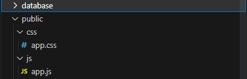

# Projecto Agile Wing

## Assets js & css

**Localização** - *./public/js & ./public/css*



## Convenções nomeação

**Referência aulas** - *5417-Aula05-Laravel.pdf slide 5-10*

    o	Controladores: BlogController (capitalizado e singular);
    
    o	Tabelas:  utilizadores ou blog_posts (sempre no plural, snake_case);

    o	Campos tabela: utilizador , id ou created_at (singular, snake_case);

    o	Chave primária: ID (numérico, auto incrementável);

    o	Chave estrangeira: utilizador_ID (nome tabela proveniente no singular e em snake_case);

    o	Tabela pivot(quando temos n:m): nomeTabA_nomeTabB (snake_case e os nomes por ordem alfabética);

    o	Variáveis: $utilizadores , $listaTarefas (camelCase)

    o	Modelo: Utilizador , Post_Utilizador (sempre capitalizado, no singular e snake_case)

## Convenção documentação de código DocBlocks

**Referência aulas** - *5417-Aula03-PHP.pdf slide 53-60*

**Exemplo 1** - *UserSeeder.php*

```php
/**
 * Generate a slightly lighter shade of a hexadecimal color.
 *
 * This function takes a hexadecimal color code as input andcalculates a
 * new color that is slightly lighter than the original color. The degree
 * of lightening is controlled by adding a fixed value to the individual
 * Red, Green, and Blue (RGB) components of the color. If any component
 * value exceeds 255, it is capped at 255 to ensure the color remains
 * within the valid range.
 *
 * @param string $color The hexadecimal color code (e.g., "#RRGGBB").
 * @return string The new hexadecimal color code of the lighter shade.
 */
protected function getLighterShade($color)
{
    $lighter = function ($val) {
        return min(255, $val + 60);
    };
    list($r, $g, $b) = sscanf($color, "#%02x%02x%02x");
    $r = $lighter($r);
    $g = $lighter($g);
    $b = $lighter($b);
    return sprintf("#%02x%02x%02x", $r, $g, $b);
}
```

**Exemplo 2** - *ScheduleAtributionFactory.php*

```php
/**
 * Generates a random time between the specified start and end times.
 *
 * @param string $start The starting time in 'H:i' format.
 * @param string $end The ending time in 'H:i' format.
 * @return string The randomly generated time in 'H:i' format.
 */
function randomTime($start, $end) {
    $startTimestamp = strtotime($start);
    $endTimestamp = strtotime($end);

    // Calculate the number of 15-minute intervals between the start and end timestamps
    $intervals = ($endTimestamp - $startTimestamp) / (15 * 60);

    // Choose a random interval
    $randomInterval = mt_rand(0, $intervals - 1);

    // Calculate the random timestamp using the selected interval
    $randomTimestamp = $startTimestamp + ($randomInterval * 15 * 60);

    return date('H:i', $randomTimestamp);
}
```
